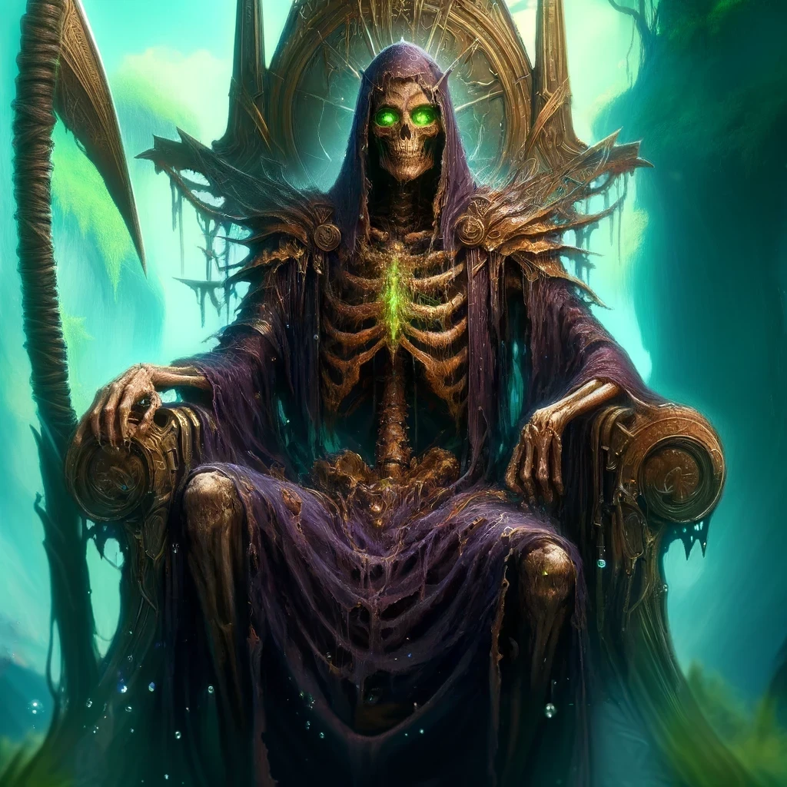

### History
 Vorenus'Kal Al Thalren Norvus began his life in a harsh reality, born into a world of famine and desolation. As a young boy, Vorenus was surrounded by the unforgiving sands of what would later be known as the [[Umbral Plains]]. Despite the desolation, from a tender age, Vorenus displayed an innate magical ability, particularly in manipulating water. While his family desperately wished to abandon the barren desert, Vorenus felt a profound connection to the land and promised them a paradise amidst the aridity.

Driven by a vision only he could see, Vorenus discovered hidden springs beneath the desert's surface. His burgeoning powers, unbeknownst to him, were not only transforming the landscape but also his own nature, mysteriously prolonging his youth. Over years that felt like lifetimes, he cultivated these waters into a thriving oasis, a verdant miracle that contrasted starkly against the desert’s bleak horizon.

When Vorenus, still appearing as a boy of twelve due to his elongated life span, sought to reunite with his family, tragedy struck. Time had not been as kind to his kin, who had aged and turned feral on the desert’s edge. Misrecognising him as a stranger and driven by dire hunger, they attacked him. In a devastating altercation, Vorenus' magic lashed out in self-defence, accidentally taking his father’s life.

Heartbroken and shunned as a devilish figure, Vorenus fled to his oasis. The isolation deepened his resolve; he swore never to let his loved ones succumb to such a fate again. However, when he attempted reconciliation years later, history repeated itself grimly. His sister, now an old woman, led an attack against him, believing him to be a malevolent spirit. In a harrowing defence, Vorenus was forced to eliminate his own kin, leaving him utterly alone.

Wracked by guilt and rage, Vorenus eradicated the cannibalistic threats around the desert, his sorrows driving him to the brink of madness. Exhausted, he stumbled upon the lost dungeon of [[Threnaliath]]. Inside, he discovered an additional source of water that seemed a miraculous life-sustaining force, which supported him for decades. This newfound spring enabled him to infuse the dungeon’s eerie silence with the vibrancy of his verdant oasis above. Initially perceived as a life-giving boon, this water facilitated his deep delving into the dungeon’s depths, where he cultivated its dark corners with a semblance of the lush greenery he cherished. Yet, these waters were a double-edged sword, preserving his life while his body decayed into that of a skeletal form.

For centuries, Vorenus cultivated this underground realm, unaware of his slow transformation. Upon defeating the dungeon’s core guardian, the [[Grave Mother]], he inadvertently embraced his fate as a lich, adopting her robes and phylactery as his own. Vorenus' mind cleared from a century-long haze of madness. Only then did he see the water's true nature—it was not the crystal-clear spring he believed but a dark, viscous fluid, akin to black blood seeping from the birthplace of the [[Grave Mother]], a sinister well leading into eternity, [[Abyssus Perpetuum]].

With newfound power, he raised the dungeon from its depths, transforming it into his palace, and in doing so revitalised the surrounding desert into a flourishing expanse. Vorenus then constructed the city of Veron around this epicentre, creating waterways that linked his oasis to the outside world, extending to the sea. His rule was both compassionate and stern, welcoming all seeking refuge while fiercely guarding the cursed waters at the city’s heart. He instituted strict laws to prevent others from suffering his fate, driven by a deep-seated fear of others enduring his endless torment.

Eight centuries later, [[Veron]] stands as a testament to Vorenus' indomitable will—a city mirroring its ruler's complex legacy of creation and sorrow, with its lich king presiding from his majestic, risen fortress.

### Description
King Vorenus'Kal Al Thalren Norvus, in his lich form, presents an image that is both haunting and regal. Beneath the eerie glow of the verdant oasis that he himself cultivated, Vorenus stands as a figure mummified by time and magic. His appearance is skeletal, with thin, leathery patches of skin stretched taut over his bones, giving him an ancient, preserved quality. In some places, the skin clings to his features, accentuating the stark contours of his skull and jawline.

His eyes, deep wells of vibrant green, shimmer with the very essence of life that pulsates from the oasis. Around him, droplets of water seem to hover, swirling in an ethereal dance that reflects his enduring connection to the waters that birthed his realm. Running through his veins is a stark contrast—the dark, viscous ooze that once promised eternal life now marks his immortality. This sinister fluid can be glimpsed through translucent patches of his skin, coursing like a slow river of shadow.

Vorenus wears robes of a deep purple, edged in gold—a colour scheme that speaks to his royal status and mystical power. These robes, despite appearing frayed at the edges, hold an enchantment that prevents them from ever truly unraveling. They flutter about him, defying gravity, as if caught in a perpetual ethereal breeze, even in the still desert air.

Preferring levitation to the mundanity of walking, Vorenus often floats above the ground, his presence both majestic and ghostly. Adorning his back is an ancient scroll, aglow with potent death magic, which serves not only as a symbol of his dominion over the afterlife but also as a constant companion whispering arcane secrets.

His weapon, a large, scythe-like hoe, is as much a tool of harvest as it is an instrument of death. This symbolic blade reflects his journey from cultivator of life to harbinger of eternity.

Vorenus' tall, gaunt form is marked by intricate tattoos visible on the scant stretches of skin that remain. His bones themselves are meticulously carved with magical sigils—a testament to his deep engagement with the arcane. These sigils glow faintly under scrutiny, a hidden script of power that pulses with his every unearthly decree.

### Characteristics
King Vorenus'Kal Al Thalren Norvus is a sovereign whose reign is defined by a profound sense of duty and a deep-seated compassion for his subjects. Despite his formidable and often chilling appearance, he governs with a gentle, albeit firm, hand. His demeanor towards his citizens is marked by an inherent kindness and an unwavering commitment to ensuring their prosperity and safety. He is tirelessly devoted to his city, continuously working to enhance the oasis and the life it supports, ensuring that none within his dominion ever experience the scarcity and despair that marked his early years.

However, Vorenus embodies a paradox—while he is a nurturing guardian to his people, he is distant and enigmatic to outsiders. His interactions with those from beyond Veron are characterised by a discerning aloofness. He is not quick to trust and even slower to open the gates of his city to strangers. His judgments are meticulous and calculated, ensuring that only those he deems worthy—those who can respect and contribute to the sanctuary he has created—may enter.

In council and conversation, Vorenus is often reserved, speaking in measured tones that resonate with quiet authority. His words, though few, carry the weight of centuries, and his decisions are rendered with the deliberation of one who views his eternal reign as a solemn responsibility. He is both a scholar and a sage, often found in deep contemplation or poring over ancient tomes that speak of forgotten magics and lost times.

Despite his eternal state, Vorenus has not lost the touch of humanity; he feels deeply, though he rarely shows it. His solitude has forged in him a reserved exterior, but beneath lies a tumultuous sea of emotions born from centuries of loss, love, and the burden of immortality. His actions, though they may appear detached, are driven by an intense desire to protect his people from the hardships he once knew.

Ultimately, King Vorenus is a figure of duality—both a protector and a sentinel, a nurturer and a guardian of his secluded paradise. His rule is a tapestry woven with threads of benevolence and isolation, a labyrinthine blend of warmth for his people and coldness towards the threats from outside, ever guarding the flourishing oasis that is Veron against the encroaching desolation of the Umbral Plains.

### Mannorisms
King Vorenus'Kal Al Thalren Norvus embodies a commanding presence, marked by movements that are deliberate and infused with an ethereal grace. His physical mannerisms convey a sense of control and precision that reflects his centuries of existence and mastery over both life and death magic. When he levitates, it is with an effortless poise that asserts his detachment from the earthly and mundane. His hands, skeletal yet elegant, often gesture subtly to emphasise points in conversation or to direct the flow of magic, their movements as fluid as the waters he once conjured to nourish the desert.

In conversation, Vorenus speaks with a voice that, although soft, carries a resonant, haunting timbre that seems to echo with the depths of time itself. His speech is slow and measured, each word chosen with care and imbued with purpose. He rarely raises his voice, finding no need to elevate his volume to assert authority—his presence alone suffices. His language is formal, reflective of ancient dialects mixed with modern vernacular, giving him a timeless quality. He often speaks in metaphorical terms, drawing on the imagery of water and desolation to paint vivid pictures with his words.

Vorenus' expressions are minimalistic, often giving away little of his internal thoughts or feelings. His face, though mostly skeletal, still manages subtle shifts that convey a range of emotions from stern disapproval to gentle kindness, readable only to those who have taken the time to understand his quiet ways. His glowing green eyes, however, are more expressive, shimmering with intensity when discussing the welfare of his city or dimming to dark pools of sorrow when reminded of his long, tumultuous past.

He has a habit of clasping his hands behind his back when listening, a posture that reinforces his aura of contemplation and reserve. When making decisions or pronouncing judgments, he often pauses, closing his eyes as if consulting the centuries of wisdom he has accumulated before responding. This not only gives him a sage-like demeanour but also reinforces the weight of every decision he makes, underscored by the awareness of its potential impact across time.

Overall, King Vorenus' physical and verbal mannerisms reflect a being who has transcended typical human expressions, embodying instead a figure shaped by the dualities of existence and eternity, always balancing between the detachment required by his immortality and the deep-seated empathy that drives his rule.

